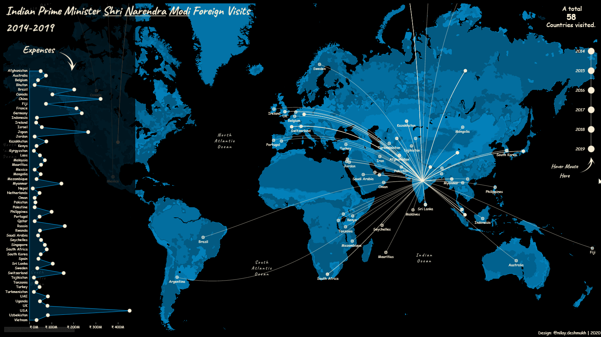
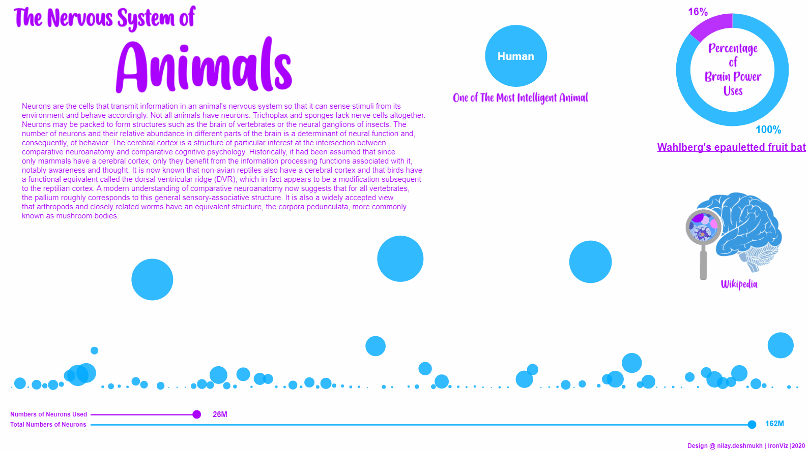
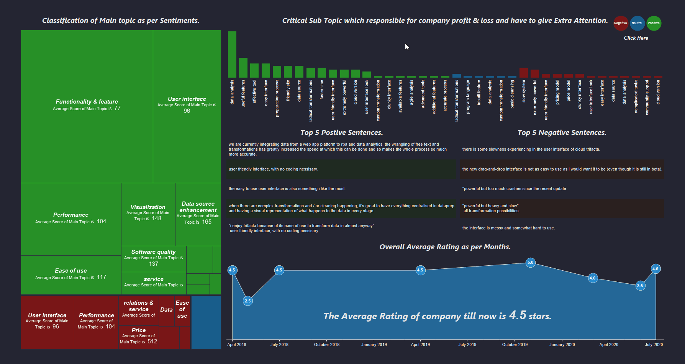

 ***Data Scientist - Python - MySQL - Tableau Vizer - Medium Blogger - Kaggle Expert***

# **About_Me**

Hey, hi there
I am an experienced data scientist passionate about Machine Learning and loves the idea of helping to make decisions with the support of data.

I can leverage my strong Statistical, Mathematical and Problem Solving skills and ability, to extract valuable insights from a highly complex large amount of structured and unstructured data. To ask the right questions and find the right answers and turn data into understandable information for effective business making decisions.

Solid understanding of machine learning fundamentals and familiar with a variety of supervised and unsupervised machine learning techniques along with deep learning techniques and their real-world advantages/drawbacks.

Experienced working with big data and relational database management system such as MySQL.
Including all of this, I always love to use my mechanical domain expertise to look at problems from outside of the box.
<!---
## Contact_Me 

* ***Linkedin*** - [*in/nilaydeshmukh*](https://www.linkedin.com/in/nilaydeshmukh/)
* ***GitHub*** - [*nilaydeshmukh0*](https://github.com/nilaydeshmukh0)
* ***Kaggle*** - [*nilaydesmukh*](https://www.kaggle.com/nilaydesmukh)
* ***Tableau_Public*** - [*Nilay Deshmukh*](https://public.tableau.com/profile/nilay.deshmukh)
* ***Medium*** - [*nilaydeshmukh*](https://medium.com/@nilaydeshmukh)
* ***Cell No.*** - [*+91 72762 62753*](#)
* ***Email*** - [*nilaydeshmukh0@gmail.com*](#)
-->
---

***It's Time to show my Work..............***

---

# **My_Projects**

&nbsp;

## [Multivariate-Time-Series-Forcasting](https://www.kaggle.com/nilaydesmukh/restaurant-demand-forecasting)

**Business Problem and Limitations -**
Our dataset is for restaurant sales for Tuesday and Wednesday, both lunch and dinner time.

There are few instances of 'To-Go' orders like Uber Eats in this dataset.

Typical lunch hour is 11:30 AM-2:00 PM, and dinner hour is 6:30 PM-10:00 PM

The data set is just for Tuesday and Wednesday. We needs to expand and randomize the data for min. of 6 months (Jan. 2019 to June 2019) for all days of the week.

A typical restaurant has high covers (number of customers) on Wednesday, Weekend Dinner, followed by Weekend Lunch, and then relatively low covers for Monday to Friday Lunch.

The data expansion/randomization should follow the above pattern for the number of customers.

**Our Gole -**
Predict the top 'Menu Item' and 'Item Qty' for Lunch and Dinner. These predictions need to be for future dates (Monday to Sunday, July 1st to July 7th) 

**Conclusion -**
We successfully forecast the demand for restaurant food items on the menu for Lunch and dinner for a given time period and also identify top items on the menu. This article shows one of many ways of demand forecasting implementation, according to me it is one of the best ways of handling multivariate forecasting business problems.

&nbsp;

<td class="tdbreak"><h2><b>Web_Scraping_&_Sentiment_Analysis</b></h2></td>

### [Amazon Product Review Scraping and Sentiment Analysis](https://github.com/nilaydeshmukh0/Text-Mining-and-Sentiment-Analysis/tree/master/Amazon%20Product%20Analysis)

In this, I scraped reviews of **Portronics POR-871 SoundDrum 4.2 Stereo Speaker (Black)** from **Amazon.in** by using scrapping python libraries such as **Beautifulsoup** and **request**. After successfully extracting reviews, I performed a sentimental analysis to find Positive and Negative sentiments of customers for this product. 

&nbsp;

### [Snapdeal Product Review Scraping and Sentiment Analysis](https://github.com/nilaydeshmukh0/Text-Mining-and-Sentiment-Analysis/tree/master/Snapdeal%20Product%20Analysis)

As I did, scrapping of **Amazon.in**, I thought can I scrap other eCommerce websites such as Snapdeal, Flipkart. Finally, I tried to scrape reviews of **Xolo Era 2 ( 8GB , 1 GB ) Black** From **Snapdeal.com**, and guess what I succeeded. After that, I performed sentiment analysis to look at what other people saying and thinking about this mobile. But, after successfully identified sentiments of other people about this mobile, it was stock out 😢😢😢😢😢.

&nbsp;

### [IMDb Review Scraping and Sentiment Analysis](https://github.com/nilaydeshmukh0/Text-Mining-and-Sentiment-Analysis/tree/master/IMDb%20Product%20Analysis)

Hey did you watched Netflix Dark? 

In my view, it is a masterpiece, one of the best and excellent series I ever saw. But it is my opinion. I want to know what other people think about it, and luckily I am a data scientist, it time to use my secret powers 🤣🤣🤣🤣. So this time, I scraped IMDb to extract the Netflix Dark review. It is a challenging task as IMDb is a dynamic website, but I did my best. After performing Sentiment analysis, I notice that it is indeed the best series. If you do not see it yet, I suggest you watch, But one caution observes minutely and be patient, you will understand it 🤣🤣🤣.

&nbsp;

## [Heroku Dashboard](https://nilaydash.herokuapp.com/login)

As deployment is one of the most essential aspects of machine learning project architecture, I always try to deploy on various platforms. Please have a look at my simple web app deployed on Heroku. 

&nbsp;

## [R Shiny Dashboard](https://thisisnilay.shinyapps.io/salary_hike/?_ga=2.41870944.314471345.1601546933-1798735927.1601546933)

This is the deployment app on the shiny dashboard. It is much easier as compared to Heroku. Still, it has its limitation, so I always prefer python and Heroku over the R and shiny because it is more user friendly and customizable.

&nbsp;

For more deployed app on R shiny [click here](https://github.com/nilaydeshmukh0/R-Shiny-Deployment). It redirects you to my Github page, which contains more shiny deployed apps, But it is locally deployed.   

&nbsp;

---

# **My_Tableau_Viz.**

&nbsp;

## [India Prime Minister Narendra Modi Foreign Visits 2014-2019](https://public.tableau.com/views/PMModiForeignVisits/final?:language=en&:display_count=y&:toolbar=n&:origin=viz_share_link)

This my dynamic tableau viz about Foreign Visits of Indian Prime Minister Narendra Modi with 92 trips to 58 countries since coming to power in May 2014, Modi has flown abroad nearly twice as much as his predecessor Manmohan Singh in five years.

&nbsp;

## [World Smoking Analysis](https://public.tableau.com/views/WorldSmokingAnalysis/Dashboard?:language=en&:display_count=y&:toolbar=n&:origin=viz_share_link)

Tobacco smoking is one of the world’s largest health problems. It has been a major health problem for many decades. For the entire 20th century it is estimated that around 100 million people died prematurely because of smoking.

&nbsp;

## [The Power of Neurons](https://public.tableau.com/shared/8M2T99BFW?:toolbar=n&:display_count=y&:origin=viz_share_link)

Neurons are the cells that transmit information in an animal's nervous system so that it can sense stimuli from its environment and behave accordingly and This visualization is shows how this neurons are prenet and work in diffrent animials.

&nbsp;

## [Company Sentiment Analysis](https://public.tableau.com/views/Class_16017874737070/Dashboard?:language=en&:display_count=y&:toolbar=n&:origin=viz_share_link)

We can use the sentiment of people about company products and services to improve company profit. The analysis of people's sentiment is one of the most important aspects of any business, It requiring special attention. The following visualization shows how people think and react for different products and services of company. We can use this kind of dashboard for future business planning.

---

# **My_Publication** 

&nbsp;

## [Multivariate Time Series Restaurant Demand Forecasting](https://medium.com/analytics-vidhya/multivariate-time-series-restaurant-demand-forecasting-1f1633875bc7?source=friends_link&sk=d814295d517949b04c96261ebe6872ed)

Checkout my Blog about Multivariate Time Series Demond Forecasting on Medium. This article shows the complete implementation of the Time Series to forecast Resutarent Food Demand.

Demand forecasting helps with business planning, budgeting, and goal setting. Once you have a good understanding of what your future sales could look like, you can begin to develop an informed procurement strategy to make sure your supply matches customer demand.
It allows businesses to more effectively optimize inventory, increase inventory turnover rates, and reduce holding costs.

***This Blog is appreciated by Varies Communities, especially Analytics Vidhya, and also published on their medium page.***

&nbsp;

[
<b>...More...</b>
](https://github.com/nilaydeshmukh0?tab=repositories)

---

Thank you for Support

